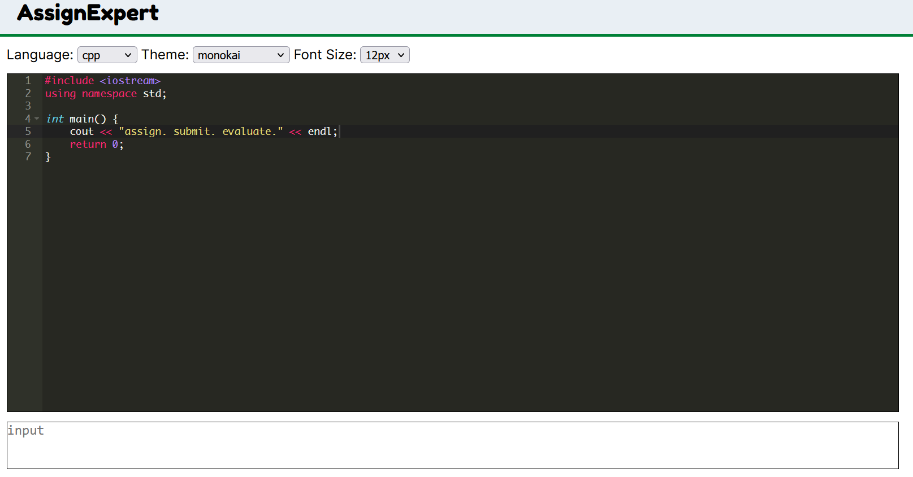

# AssignExpert

  

AssignExpert is a web based platform for educational institutions to host and evaluate programming assignments. 

## Key Features

- [x] Execute code
- [x] Let a faculty create a class
- [x] Let a student join a class
- [x] Let a faculty create assignments with testcases
- [x] Let a student view assignment, submit code
- [x] Let a student see all personal submissions
- [x] Let a faculty see all submissions 

...*and many more!*

To sandbox user-submitted code, we use Docker. To set it up, steps are mentioned below in this document. 

## Documentation 

API documentation can be found [here](https://assignexpert.github.io/assignexpert/). 

## Setup

1. Install Node (>=v16.0). 
2. Install Redis. 
3. Install PostgreSQL and a create a database with the name `assignexpert`. 
4. Install Docker. 
5. Run: `bash scripts/docker-build.sh` (this setup is data-intensive as it will download a lot of images from the internet). 
6. Prepare your `.env` file using the [.env.example](/.env.example) file. 
7. Do, `npm install` to install node level dependencies. 
8. Start your PostgreSQL server. 
9. Start your Redis server. 
10. Run: `psql -d assignexpert < src/scripts/schema.sql`. 
11. Do, `npm run dev` to start the server. 

## Contributing

Please read the [organization standard](https://github.com/assignexpert/standard). 

## Paper

Coming soon! 

## LICENSE

[MIT](./LICENSE) 